# RampKit LATAM

**The missing integration layer between Latin American bank accounts and Stellar — PIX, SPEI, and Khipu behind one API.**

[](https://www.npmjs.com/package/rampkit-latam-core)
[](https://www.npmjs.com/package/rampkit-latam-ui)
[](https://rampkit-latam.vercel.app)
[](https://stellar.org)
[](https://opensource.org/licenses/MIT)

> Built for the [Stellar Builder Summit SP 2026 — Brazil Ramps & Regional Kits Bounty](https://app.grantfox.io).

---

## The Problem

A Brazilian developer wants to let users buy USDC with PIX. It should take an afternoon. It takes a quarter.

Here is why. There is no anchor that covers Latin America. Etherfuse does Brazil, Mexico, and the US. Manteca does Brazil. Koywe does Chile and Mexico. Cover the region and you are integrating three providers — three authentication schemes, three quote formats, three order lifecycles, three sets of error codes, three polling strategies. None of them agree on anything.

Then you build the interface. "Enter amount → show the rate → render a QR code → poll until it settles → confirm." Every team that has ever shipped a ramp has written that exact flow, and every team has written it from scratch.

And after all of it, your users still get a worse price than they should — because an app wired to one anchor cannot compare. It quotes whatever that provider offers, and the user has no way to know a better rate existed three lines of code away.

The predictable outcome: most apps support a single anchor and accept the narrow coverage, or they burn months gluing fragmented APIs together. Either way **Latin American users end up with fewer, slower, more expensive routes onto Stellar than the rails underneath can actually deliver.**

---

## The Solution

RampKit LATAM is an open-source toolkit that removes each of those steps in turn. Four layers, each usable on its own:

```
┌─────────────────────────────────────────────────────────┐
│  Layer 4: rampkit-latam-x402 (Agentic Payments)         │
│  Sell an API to AI agents priced in BRL/MXN/CLP —       │
│  resolves to stablecoin at the live corridor rate       │
├─────────────────────────────────────────────────────────┤
│  Layer 3: Soroban Smart Contract (savings-vault)        │
│  On-chain vault with per-second yield accrual,          │
│  rate-matched to TESOURO's published 13.25% APY         │
├─────────────────────────────────────────────────────────┤
│  Layer 2: rampkit-latam-ui (React Components)           │
│  Drop-in <RampWidget/>, <SavingsWidget/>,               │
│  <StatusTracker/>, <QuoteCard/> — ready to embed        │
├─────────────────────────────────────────────────────────┤
│  Layer 1: rampkit-latam-core (TypeScript SDK)           │
│  Unified router for Etherfuse, Manteca, and Koywe —     │
│  parallel quotes plus cross-border remittance routing   │
└─────────────────────────────────────────────────────────┘
```

You install one package and get the router. You install two and the entire checkout renders itself. Nothing forces you up the stack — the UI kit is optional, the vault is optional, the agent-payments layer is optional.

---

## What Each Layer Does

### Layer 1: `rampkit-latam-core` — The Router SDK

A TypeScript library that collapses the differences between anchors into a single interface.

**Before RampKit** — three integrations you maintain forever:
```typescript
// Etherfuse — custom auth, custom quote format
const efQuote = await fetch('https://api.etherfuse.com/ramp/quote', { ... });

// Manteca — different auth, different format
const maQuote = await fetch('https://api.manteca.io/v1/quotes', { ... });

// Koywe — yet another auth, yet another format
const koQuote = await fetch('https://api.koywe.com/rest/quotes', { ... });

// Now manually normalize, compare, and pick the best one...
```

**After RampKit** — one call, every anchor, sorted by what the user actually receives:
```typescript
import { RampRouter } from 'rampkit-latam-core';

const router = new RampRouter({
  network: 'testnet',
  anchors: {
    etherfuse: { apiKey: process.env.ETHERFUSE_API_KEY!, sandbox: true },
    manteca:   { apiKey: process.env.MANTECA_API_KEY!, sandbox: true },
    koywe:     { apiKey: process.env.KOYWE_API_KEY!, sandbox: true },
  },
});

const quotes = await router.getQuotes({
  direction: 'on-ramp',
  sourceAsset: 'BRL',
  destAsset: 'USDC',
  amount: '100',
  country: 'BR',
});
```

**What you get:**

- **Parallel quote comparison** — every configured anchor is queried at once and ranked by best payout. A slow or failing anchor is dropped from the comparison rather than blocking it.
- **Unified order lifecycle** — `executeRamp()` and `getStatus()` behave identically no matter which anchor is executing the trade.
- **Cross-border remittance routing** — `getRemittanceQuote()` composes two ramp legs through a stablecoin bridge and quotes each leg independently, so a transfer can on-ramp through one anchor and off-ramp through another. **26 corridors** with all three anchors configured. *(Requires core ≥ 1.1.0 — build from source; the published 1.0.1 predates this API.)*
- **Stellar transaction resolution** — anchors return transaction identifiers in inconsistent formats; the SDK resolves them to the 64-character hex hash that [Stellar Expert](https://stellar.expert/explorer/testnet) expects, so explorer links always work.

### Layer 2: `rampkit-latam-ui` — The React UI Kit

The checkout flow every ramp needs, already built.

| Component | What it does |
|-----------|-------------|
| `<RampWidget />` | Full checkout: asset selection → quote comparison → PIX/SPEI QR code → status polling → browser notification on completion |
| `<SavingsWidget />` | Yield dashboard driven by the Soroban vault's on-chain state — principal, accrued yield, daily accrual, APY |
| `<StatusTracker />` | Step-by-step order progress with clickable Stellar Explorer links |
| `<QuoteCard />` | Side-by-side anchor comparison highlighting the best rate and its fees |

```tsx
import { RampWidget } from 'rampkit-latam-ui';
import 'rampkit-latam-ui/src/styles/rampkit.css';

// A complete PIX checkout, in one line
<RampWidget router={router} stellarAddress="G..." locale="pt-BR" />
```

English, Spanish, and Brazilian Portuguese ship built in via the `locale` prop — including locale-correct number formatting, so a Brazilian user sees `1.632,52` and not `1,632.52`.

### Layer 3: Soroban Smart Contract — Savings Vault

The ramp is a means, not an end. Most people do not want to hold USDC; they want their money to grow. This contract turns the ramp into a savings product:

1. User deposits BRL via PIX → receives USDC on Stellar
2. USDC is deposited into the on-chain vault
3. The vault accrues yield every second at a configurable APY — currently set to 13.25%, matching [TESOURO](https://etherfuse.com/), Etherfuse's tokenized Brazilian treasury bond
4. User withdraws yield or principal → converts back to BRL via PIX

From the user's side that reads: **"Deposit via PIX → earn 13% → withdraw via PIX."** No wallet, no seed phrase, no crypto vocabulary anywhere in the flow.

> **Exactly how the yield works — read this before evaluating the claim.** The accrual is real and on-chain: `principal × elapsed_seconds × rate_bps ⁄ (10,000 × seconds_per_year)`, recomputed on every deposit, withdrawal, and state read, and withdrawable today on testnet. What it is *not* is TESOURO-backed. The vault does not custody TESOURO yet, and `rate_bps` is set by the admin to mirror TESOURO's published APY rather than derived from the token's NAV. Making the vault hold the real instrument is the next step, and we would rather say so than let a reviewer discover it in the source.

### Layer 4: `rampkit-latam-x402` — The Agentic Payments Kit

x402 lets a machine buy from a machine: the server answers `402 Payment Required`, the agent pays on Stellar, the resource comes back. It is a clean protocol with one assumption that does not survive contact with Latin America — **it denominates prices in the settlement token.**

A Brazilian developer does not price in USDC. They price in reais. Hardcode `0.0875 USDC` because that is what R$0,50 is worth today, and your price silently drifts every time the corridor moves.

This kit closes that gap. Declare the price in local currency; the kit resolves it to token base units **on every request**, using the same router from Layer 1:

```ts
app.use(latamPaymentMiddleware({
  router,
  payTo: process.env.STELLAR_RECIPIENT!,
  ozApiKey: process.env.OZ_API_KEY!,
  routes: {
    'GET /cotacao':     { price: { amount: '0.50', currency: 'BRL' } },
    'GET /tipo-cambio': { price: { amount: '2.00', currency: 'MXN' } },
  },
}));
```

Resolution verified against live anchor quotes: **R$ 0,50 → 0.0875 USDC** and **$2.00 MXN → 0.1040 USDC**. Agents hold the settlement token and **no XLM** — the facilitator sponsors network fees, so an agent never has to manage a gas balance. Sample paid API and buyer agent in [examples/x402-agent](examples/x402-agent).

---

## End-to-End Flow

What actually happens when a Brazilian user deposits R$100 to start earning:

```mermaid
sequenceDiagram
    participant U as User (Brazil)
    participant APP as Your App
    participant SDK as rampkit-latam-core
    participant EF as Etherfuse API
    participant SN as Stellar Network
    participant SC as Soroban Vault

    rect rgb(10, 50, 10)
    Note over U, EF: ON-RAMP: PIX → USDC
    U->>APP: "Depositar R$ 100"
    APP->>SDK: router.getQuotes({ BRL→USDC })
    SDK->>EF: Fetches best quote
    EF-->>APP: R$ 100 → 17.50 USDC
    APP->>U: Shows PIX QR code
    U->>EF: Pays PIX
    EF->>SN: Sends 17.50 USDC to user wallet
    end

    rect rgb(50, 10, 50)
    Note over APP, SC: DEPOSIT INTO VAULT
    APP->>SC: deposit(owner, 17.50 USDC)
    SC-->>APP: Yield accrual starts
    end

    rect rgb(50, 50, 10)
    Note over SC, SC: YIELD ACCRUAL (13.25% APY)
    Note over SC: After 1 year: ~$2.32 earned
    end

    rect rgb(10, 10, 50)
    Note over U, EF: OFF-RAMP: USDC → PIX
    U->>APP: "Sacar ganancias"
    APP->>SC: withdraw_yield(owner, amount)
    SC-->>APP: USDC transferred
    APP->>SDK: router.getQuotes({ USDC→BRL, off-ramp })
    EF->>U: PIX sent to bank account
    end
```



**On what is live versus simulated, precisely.** Each adapter calls its anchor's real sandbox API first. If that sandbox is unreachable or rejects the credentials, the adapter falls back to a realistic simulated quote and order — a deliberate choice, because a demo that dies when a third-party sandbox has a bad afternoon is worthless to a reviewer. The Stellar leg is never simulated either way: even on the fallback path the SDK generates a keypair, funds it through Friendbot, and submits a real payment operation to testnet via Horizon. The explorer link always points at a transaction that actually exists.

---

## Supported Countries & Corridors

| Country | Currency | Payment Method | Anchors | Assets Available | Yield |
|---------|----------|----------------|---------|-----------------|-------|
| 🇧🇷 Brazil | BRL | PIX | Etherfuse, Manteca | USDC, TESOURO | 13.25% APY |
| 🇲🇽 Mexico | MXN | SPEI | Etherfuse, Koywe | USDC, CETES | 10.50% APY |
| 🇨🇱 Chile | CLP | Khipu | Koywe | USDC | — |
| 🇺🇸 USA | USD | ACH / Wire | Etherfuse | USDC, USTRY | 4.80% APY |

Any origin country can pay out to any other, which is what produces the 26 remittance corridors — that figure assumes all three anchors are configured, and drops as you configure fewer.

---

## Proof It Works

Numbers below were produced by running the code, not by estimating.

| Claim | Evidence |
|---|---|
| The router really compares anchors | R$2.400 checkout returns Etherfuse at **413,70 USDC** (1.5% fee) against Manteca at **403,56 USDC** (5.0% fee), best rate flagged |
| The UI kit works outside this repo | [examples/vite-storefront](examples/vite-storefront) installs both packages from the public npm registry on a different stack (Vite, not Next.js) and renders the full checkout |
| Remittances route across anchors | R$500 Brazil→Mexico settles at **1.632,52 MXN** — 2.99% total fees end to end, both legs itemized in the UI |
| Local-currency pricing is live, not hardcoded | **R$ 0,50 → 0.0875000 USDC**, **$2.00 MXN → 0.1040000 USDC**, resolved per request from anchor quotes |
| The vault math is on-chain | Per-second accrual verified on testnet; deposit, withdraw yield, withdraw principal, and full exit all exercised |

---

## Project Structure

```
rampkit-latam/
├── packages/
│   ├── core/            # rampkit-latam-core — router SDK + remittance routing
│   ├── ui/              # rampkit-latam-ui — React component library
│   └── x402/            # rampkit-latam-x402 — agentic payments kit
├── contracts/
│   └── savings-vault/   # Soroban smart contract — yield vault
├── demo/                # Next.js demo (Vercel) — ramp, savings, remittance
├── examples/
│   ├── vite-storefront/ # Second-app proof — installs both packages from npm
│   └── x402-agent/      # Paid FX API + buyer agent
├── docs/                # SDK reference, UI guide, savings flow deep-dive
└── scripts/             # Testnet setup & deployment utilities
```

---

## Quick Start

```bash
git clone https://github.com/WritzProtocol/rampkit-latam.git
cd rampkit-latam

npm install          # installs all workspaces
npm run build        # builds core, ui, and x402
npm run dev          # demo app on http://localhost:3000
```

The demo runs with no configuration. Anchor sandboxes reject the placeholder keys and the SDK falls back to simulated quotes, so every screen works out of the box. To hit the live Etherfuse sandbox instead, run `npx tsx scripts/setup-testnet.ts` and supply real credentials.

Three routes are worth visiting:

| Route | What it demonstrates |
|---|---|
| `/` | Landing page — the pitch, in PT/ES/EN |
| `/playground` | RampWidget and SavingsWidget side by side |
| `/remittance` | Cross-border corridors with the full two-leg settlement breakdown |

### Using the SDK in your own project

```bash
npm install rampkit-latam-core rampkit-latam-ui
```

```tsx
import { RampRouter } from 'rampkit-latam-core';
import { RampWidget } from 'rampkit-latam-ui';
import 'rampkit-latam-ui/src/styles/rampkit.css';

const router = new RampRouter({
  network: 'testnet',
  anchors: {
    etherfuse: { apiKey: 'YOUR_KEY', sandbox: true },
  },
});

function App() {
  return <RampWidget router={router} stellarAddress="G..." locale="pt-BR" />;
}
```

> The stylesheet lives at `rampkit-latam-ui/src/styles/rampkit.css`. It ships as source rather than build output because the package compiles with `tsc`, which emits JavaScript only.

---

## Bounty Alignment

This project addresses **all five** suggested deliverables from the Brazil Ramps sub-lane:

| Bounty Deliverable | Our Implementation | Status |
|---|---|---|
| **Multi-anchor router** — "one API, multiple anchors, live quotes" | `rampkit-latam-core` — `getQuotes()` queries Etherfuse, Manteca, and Koywe in parallel and ranks by best payout | Complete |
| **Ramp UX kit** — "documented, importable, works in a second app" | `rampkit-latam-ui` on npm, proven in a genuine second app: [examples/vite-storefront](examples/vite-storefront) sits outside the workspace on a different stack, installs from the public registry, and returns live parallel quotes | Complete |
| **PIX ramp integration** — "BRL in and out via PIX into Etherfuse USDC/TESOURO" | PIX QR → Etherfuse sandbox → real signed Stellar testnet transaction → working explorer link | Complete |
| **Cross-border remittance demo** — "PT/ES-localized flow on a regional stablecoin" | [`/remittance`](demo/src/app/remittance/page.tsx) in PT/ES/EN across BR/MX/CL/US, showing which anchor serves each leg, the bridge amount, and the effective end-to-end rate | Complete |
| **LATAM stablecoin dev kit** — "plug-and-play kit for a regional stablecoin that plugs into x402/MPP" | `rampkit-latam-x402` — price routes in BRL/MXN/CLP, settle in stablecoin at the live corridor rate, plus [a sample paid API and buyer agent](examples/x402-agent) | Kit complete, settlement unverified |

**Why the last row carries a warning.** The kit compiles, the middleware mounts, the sample server boots, and local-currency pricing is verified against live anchor quotes. What has *not* been executed is an actual paid request end to end, because that needs two credentials that are Captcha-gated and cannot be provisioned programmatically: an OZ Channels facilitator key and testnet USDC from the Circle faucet. The [example README](examples/x402-agent/README.md) lists both steps with the exact URLs. We are flagging this rather than claiming a green check we did not earn.

---

## Where RampKit Fits in the Stellar Ecosystem

LATAM ramps are not an empty category — several SCF-funded teams are already working in it, and pretending otherwise would be dishonest:

| Project | What they do | SCF funding |
|---|---|---|
| [Abroad](https://github.com/abroad-finance/abroad) | Interoperability layer between Stellar wallets and QR fiat payments | $149,820 (rounds 32, 35) |
| Conomy | LATAM payment gateway covering crypto on/off-ramps + local rails | $103,000 (round 41) |
| [TuCambio](https://github.com/tucambioapp) | Stellar-based on/off-ramp API for LATAM markets | $75,000 (round 37) |
| DomiPago, Puenta | Single-corridor remittance apps (Dominican diaspora, migrant transfers) | $110,000 / $171,294 |

Each one solves a real piece — one corridor, one payment rail, one interoperability layer. None of them ship the whole stack as installable open source: **a router across multiple named anchors, a drop-in React UI kit, an on-chain yield product, and an agent-payments layer.** A developer building on any project above still has to write the router, or the UI, or the vault themselves.

The gap is not "nobody is building ramps on Stellar." It is that **nobody has packaged the stack so the next developer does not have to rebuild it.** That is the gap RampKit closes.

---

## Links

| Resource | Link |
|----------|------|
| Live Demo | [rampkit-latam.vercel.app](https://rampkit-latam.vercel.app) |
| Core SDK (npm) | [`rampkit-latam-core`](https://www.npmjs.com/package/rampkit-latam-core) |
| UI Kit (npm) | [`rampkit-latam-ui`](https://www.npmjs.com/package/rampkit-latam-ui) |
| x402 Kit | [packages/x402](packages/x402) — pending npm publish |
| Second-app proof | [examples/vite-storefront](examples/vite-storefront) |
| Agent payments demo | [examples/x402-agent](examples/x402-agent) |
| SDK Reference | [docs/SDK_REFERENCE.md](docs/SDK_REFERENCE.md) |
| UI Guide | [docs/UI_GUIDE.md](docs/UI_GUIDE.md) |
| Savings Flow | [docs/SAVINGS_FLOW.md](docs/SAVINGS_FLOW.md) |
| Getting Started | [docs/README.md](docs/README.md) |

---

## License

MIT © RampKit LATAM Team
