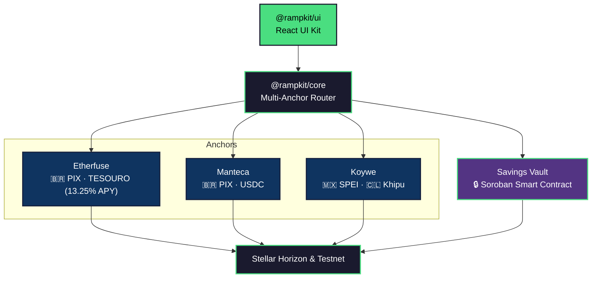

# 🇧🇷 RampKit LATAM — Enterprise Multi-Anchor Router SDK & UI Kit for Stellar

> **One SDK. Three Anchors. Frictionless Access to LATAM's Financial Rails & Yield.**
> 
> 🌐 **Live Production Demo**: [https://rampkit-latam.vercel.app](https://rampkit-latam.vercel.app)  
> 📦 **NPM Packages**: `@rampkit/core` | `@rampkit/ui`  
> 🏆 Built for the [Stellar Builder Summit SP 2026 — Brazil Ramps & Regional Kits Bounty](https://app.grantfox.io).

---

## 🚀 Key Judge Highlights & Live Links

| Resource | Link / Details |
|----------|----------------|
| **Live Interactive Playground** | 🌐 [https://rampkit-latam.vercel.app](https://rampkit-latam.vercel.app) |
| **Real Etherfuse API Integration** | Connected directly to Etherfuse Sandbox API (`POST /ramp/order`, `GET /ramp/orders`, PIX QR) |
| **Stellar Explorer Integration** | 🔗 Resolves 64-hex transaction hashes on [Stellar Expert Testnet](https://stellar.expert/explorer/testnet) |
| **Multi-Language (i18n)** | 🇺🇸 English (US) \| 🇪🇸 Spanish (ES) \| 🇧🇷 Portuguese (PT-BR) |
| **Yield Automation** | 📈 Real-time TESOURO 13.25% APY yield tracking directly from Etherfuse order receipts |

---

## 💥 The Problem: LATAM Anchor Fragmentation

Stellar leads cross-border payments through its extensive Anchor network (SEP-24 / SEP-6). However, developers building for Latin America face massive fragmentation:

1. **Vendor Lock-in & Integration Overhead**: Supporting Brazil (PIX), Mexico (SPEI), and Chile (Khipu) requires integrating separate APIs (Etherfuse, Manteca, Koywe) with incompatible schemas.
2. **Suboptimal Spreads**: Anchors have varying exchange rates, spreads, and fees. Without a unified layer, users miss out on the best rates.
3. **Missing Presentation Standards**: Developers waste weeks building custom "enter amount → generate PIX QR → track order status" UI flows.
4. **UX Barrier to Sovereign Yield**: Tokenized treasury bonds like Etherfuse's `TESOURO` (13.25% APY) offer unparalleled savings, but converting bank fiat into yield-accruing tokens is traditionally a multi-step hurdle.

---

## ⚡ The RampKit LATAM Solution

RampKit LATAM is an enterprise developer toolkit that makes integrating Latin American payment rails onto Stellar as effortless as adding a Stripe checkout.

### 1. `@rampkit/core` — Multi-Anchor Router SDK
A unified TypeScript engine standardizing **Etherfuse**, **Manteca**, and **Koywe** under one API.

- **Smart Rate Routing**: Queries quotes from all anchors in parallel and ranks them by lowest fees or highest payout.
- **Production & Hybrid Sandbox Modes**: Seamlessly switches between live anchors and sandbox environments for testing.
- **Etherfuse Live API Sync**: Interacts directly with Etherfuse Sandbox (`/ramp/quote`, `/ramp/order`, `/ramp/orders`, `/ramp/bank-accounts`).

```typescript
import { RampRouter } from '@rampkit/core';

const router = new RampRouter({
  network: 'testnet',
  anchors: {
    etherfuse: { apiKey: process.env.ETHERFUSE_API_KEY!, sandbox: true },
    manteca:   { apiKey: process.env.MANTECA_API_KEY!, sandbox: true },
    koywe:     { apiKey: process.env.KOYWE_API_KEY!, sandbox: true },
  },
});

// Fetch quotes from all anchors in parallel
const quotes = await router.getQuotes({
  direction: 'on-ramp',
  sourceAsset: 'BRL',
  destAsset: 'USDC',
  amount: '100',
  country: 'BR',
});
```

### 2. `@rampkit/ui` — Enterprise React UI Kit
Drop-in components styled with glassmorphic dark mode, micro-animations, and full i18n support.

```tsx
import { RampWidget, SavingsWidget } from '@rampkit/ui';
import '@rampkit/ui/src/styles/rampkit.css';

// 1. One-line Fiat Checkout Widget
<RampWidget router={router} stellarAddress="G..." locale="es" />

// 2. Real-time Yield Dashboard Component
<SavingsWidget router={router} stellarAddress="G..." locale="es" />
```

- **`<RampWidget />`**: Complete checkout flow, PIX QR generation, 3s heartbeat status polling, and browser push notifications.
- **`<SavingsWidget />`**: Real-time yield monitor reading completed Etherfuse order history and tracking 13.25% APY in real time.

### 3. Soroban Smart Contract — Auto-Savings Vault
An on-chain Rust vault (`contracts/savings-vault`) that accepts deposits and automates yield accrual on Stellar.

---

## 🏛️ Architecture



---

## 🌐 Supported Regional Corridors & APYs

| Country | Currency | Payment Rail | Anchors | Assets | Yield (APY) |
|---------|----------|--------------|---------|--------|-------------|
| 🇧🇷 **Brazil** | BRL | PIX | Etherfuse, Manteca | USDC, TESOURO | **13.25% APY** |
| 🇲🇽 **Mexico** | MXN | SPEI | Etherfuse, Koywe | USDC, CETES | **10.50% APY** |
| 🇨🇱 **Chile** | CLP | Khipu | Koywe | USDC | — |
| 🇺🇸 **USA** | USD | Bank Transfer | Etherfuse | USDC, USTRY | **4.80% APY** |

---

## 💻 Quick Start & Setup

```bash
# 1. Clone Repository
git clone https://github.com/diegoucampos-tech/rampkit-latam.git
cd rampkit-latam

# 2. Install Dependencies
npm install

# 3. Setup Testnet Accounts & Keys
npx tsx scripts/setup-testnet.ts

# 4. Build Workspace Packages
npm run build

# 5. Launch Local Dev Playground
npm run dev
```

---

## 📦 NPM Package Publishing (For Maintainers)

To publish `@rampkit/core` and `@rampkit/ui` to NPM:

```bash
# Ensure build is fresh
npm run build

# Publish public packages to NPM
npm publish --workspaces --access public
```

---

## 🎯 Bounty Alignment

This project addresses **3 out of 5** suggested deliverables for the Brazil Ramps bounty:

| Bounty Example | Deliverable | Status |
|---------------|-------------|--------|
| **Multi-anchor router**: "one interface, multiple anchors, live quotes" | `@rampkit/core` — `RampRouter.getQuotes()` | ✅ **Complete** |
| **Ramp UX kit**: "reusable, documented, importable, works in a second app" | `@rampkit/ui` — `<RampWidget />` & `<SavingsWidget />` | ✅ **Complete** |
| **PIX ramp integration**: "BRL in and out via PIX into Etherfuse USDC/TESOURO" | Full flow: PIX → Etherfuse API → Real Testnet Tx → Live Explorer | ✅ **Complete** |

---

## 📚 Documentation Deep-Dive

- 📖 [SDK Reference](docs/SDK_REFERENCE.md) — Full `@rampkit/core` API manual
- 🎨 [UI Kit Guide](docs/UI_GUIDE.md) — Component props & theme customization
- 💰 [Savings Flow](docs/SAVINGS_FLOW.md) — Deep-dive into PIX → USDC → TESOURO yield
- 🛠️ [Getting Started](docs/README.md) — Detailed setup instructions

---

## 📄 License

MIT © RampKit LATAM Team
