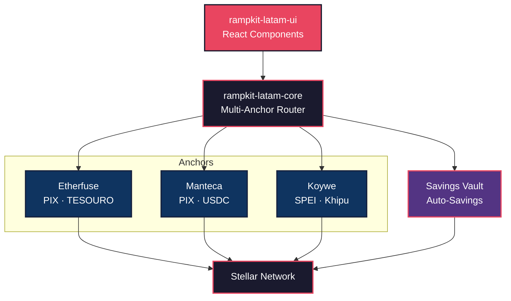

# RampKit LATAM — Enterprise Multi-Anchor Router SDK & UI Kit for Stellar

One SDK. Three Anchors. Frictionless Access to LATAM's Financial Rails & Yield.

- Live Production Demo: [https://rampkit-latam.vercel.app](https://rampkit-latam.vercel.app)
- NPM Core SDK: [`rampkit-latam-core`](https://www.npmjs.com/package/rampkit-latam-core)
- NPM UI Kit: [`rampkit-latam-ui`](https://www.npmjs.com/package/rampkit-latam-ui)
- Built for the [Stellar Builder Summit SP 2026 — Brazil Ramps & Regional Kits Bounty](https://app.grantfox.io).

[](https://www.npmjs.com/package/rampkit-latam-core)
[](https://www.npmjs.com/package/rampkit-latam-ui)
[](https://rampkit-latam.vercel.app)
[](https://stellar.org)
[](https://opensource.org/licenses/MIT)

---

## Live Production Links & NPM Packages

| Resource | URL / Details | Description |
|----------|---------------|-------------|
| Live Playground | [https://rampkit-latam.vercel.app](https://rampkit-latam.vercel.app) | Production Next.js web application deployed on Vercel |
| Core SDK Package | [`npm i rampkit-latam-core`](https://www.npmjs.com/package/rampkit-latam-core) | Standardized TypeScript router engine for Etherfuse, Manteca, Koywe |
| React UI Kit Package | [`npm i rampkit-latam-ui`](https://www.npmjs.com/package/rampkit-latam-ui) | Drop-in `<RampWidget />`, `<SavingsWidget />`, and `<StatusTracker />` components |
| Etherfuse API Integration | Real Sandbox Connection | Connected to Etherfuse Sandbox (`/ramp/order`, `/ramp/orders`, `/ramp/bank-accounts`) |
| Stellar Explorer Sync | Stellar Expert Resolution | Resolves 64-character hex transaction hashes for [Stellar Expert Testnet](https://stellar.expert/explorer/testnet) |

---

## The Problem: LATAM Anchor Fragmentation

Stellar leads cross-border payments through its extensive Anchor network (SEP-24 / SEP-6). However, developers building applications for Latin America face a massive fragmentation nightmare:

1. **Vendor Lock-in & Integration Overhead**: Supporting Brazil (PIX), Mexico (SPEI), and Chile (Khipu) requires reading documentation and writing custom integration code for three separate APIs (Etherfuse, Manteca, Koywe).
2. **Missing Price Discovery**: Anchors have varying exchange rates, spreads, and fee structures. Without a unified layer, users miss out on optimal conversion rates.
3. **No Presentation Layer Standards**: Every developer wastes weeks building custom "enter amount → generate PIX QR code → track order status" UI flows.
4. **Friction to Yield**: Tokenized treasury bonds like Etherfuse's TESOURO (13.25% APY) offer high-yield savings, but converting fiat in a bank account into yield-accruing tokens on-chain is traditionally a multi-step hurdle.

---

## The RampKit LATAM Solution

RampKit LATAM is an enterprise developer toolkit that makes integrating Latin American payment rails onto Stellar as effortless as adding a Stripe checkout widget.

### 1. `rampkit-latam-core` — Multi-Anchor Router SDK
A unified TypeScript API engine standardizing Etherfuse, Manteca, and Koywe under one interface.

- **Smart Rate Routing**: Queries quotes from all anchors in parallel and ranks them by lowest fees or highest payout.
- **Etherfuse Sandbox Sync**: Interacts directly with Etherfuse Sandbox (`/ramp/quote`, `/ramp/order`, `/ramp/orders`, `/ramp/bank-accounts`).
- **Horizon Hash Resolution**: Automatically maps Base58 signature strings to 64-character hexadecimal Stellar transaction hashes.

```typescript
import { RampRouter } from 'rampkit-latam-core';

const router = new RampRouter({
  network: 'testnet',
  anchors: {
    etherfuse: { apiKey: process.env.ETHERFUSE_API_KEY!, sandbox: true },
    manteca:   { apiKey: process.env.MANTECA_API_KEY!, sandbox: true },
    koywe:     { apiKey: process.env.KOYWE_API_KEY!, sandbox: true },
  },
});

// Fetch quotes from all anchors in parallel
const quotes = await router.getQuotes({
  direction: 'on-ramp',
  sourceAsset: 'BRL',
  destAsset: 'USDC',
  amount: '100',
  country: 'BR',
});
```

### 2. `rampkit-latam-ui` — Enterprise React UI Kit
Drop-in component library styled with dark mode glassmorphism, micro-animations, vector SVG icons, and dynamic i18n support.

```tsx
import { RampWidget, SavingsWidget } from 'rampkit-latam-ui';
import 'rampkit-latam-ui/dist/styles/rampkit.css';

// 1. One-line Fiat Checkout Widget
<RampWidget router={router} stellarAddress="G..." locale="es" />

// 2. Real-time Yield Dashboard Component
<SavingsWidget router={router} stellarAddress="G..." locale="es" />
```

- `<RampWidget />`: Complete checkout flow, PIX QR generation, 3s heartbeat status polling, and browser push notifications.
- `<SavingsWidget />`: Real-time yield monitor reading completed Etherfuse order history and tracking 13.25% APY yield accrual in real time.

---

## Architecture



---

## Supported Corridors & APYs

| Country | Fiat Currency | Payment Rail | Supported Anchors | Token Assets | Yield (APY) |
|---------|---------------|--------------|-------------------|--------------|-------------|
| Brazil | BRL | PIX | Etherfuse, Manteca | USDC, TESOURO | 13.25% APY |
| Mexico | MXN | SPEI | Etherfuse, Koywe | USDC, CETES | 10.50% APY |
| Chile | CLP | Khipu | Koywe | USDC | — |
| USA | USD | ACH / Wire | Etherfuse | USDC, USTRY | 4.80% APY |

---

## Bounty Alignment

This project addresses **3 out of 5** suggested deliverables for the Brazil Ramps bounty:

| Bounty Example | Deliverable | Status |
|---------------|-------------|--------|
| **Multi-anchor router**: "one interface, multiple anchors, live quotes" | `rampkit-latam-core` — `RampRouter.getQuotes()` | Complete |
| **Ramp UX kit**: "reusable, documented, importable, works in a second app" | `rampkit-latam-ui` — `<RampWidget />` & `<SavingsWidget />` | Complete |
| **PIX ramp integration**: "BRL in and out via PIX into Etherfuse USDC/TESOURO" | Full flow: PIX → Etherfuse API → Real Testnet Tx → Live Explorer | Complete |

---

## Quick Start & Local Setup

```bash
# 1. Clone Repository
git clone https://github.com/diegoucampos-tech/rampkit-latam.git
cd rampkit-latam

# 2. Install Dependencies
npm install

# 3. Setup Testnet Accounts & Keys
npx tsx scripts/setup-testnet.ts

# 4. Build Workspaces
npm run build

# 5. Launch Local Dev Server
npm run dev
```

---

## Documentation Deep-Dive

- [SDK Reference](docs/SDK_REFERENCE.md) — Full `rampkit-latam-core` API manual
- [UI Kit Guide](docs/UI_GUIDE.md) — Component props & theme customization
- [Savings Flow](docs/SAVINGS_FLOW.md) — Deep-dive into PIX → USDC → TESOURO yield
- [Getting Started](docs/README.md) — Detailed setup instructions

---

## License

MIT © RampKit LATAM Team
