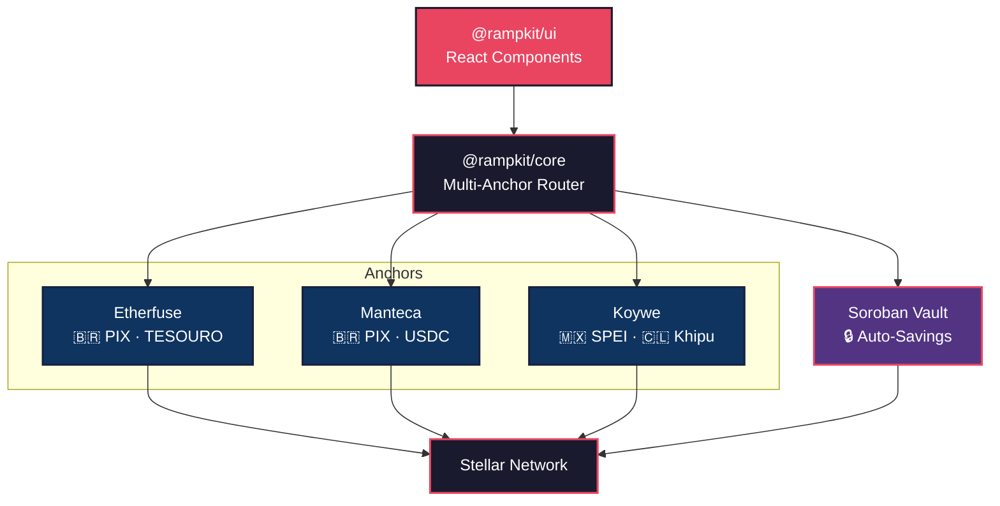

# 🇧🇷 RampKit LATAM — Multi-Anchor Router SDK for Stellar

> **One SDK. Three anchors. All of LATAM's ramps.**
> Built for the [Stellar Builder Summit SP 2026 — Brazil Ramps & Regional Kits Bounty](https://app.grantfox.io).

## The Problem

Developers building on Stellar who need fiat on/off-ramps in Latin America face a **fragmented nightmare**:

- **Each anchor has a different API** — Etherfuse, Manteca, and Koywe each have their own auth, endpoints, and data formats
- **No smart routing** — There's no way to compare rates across anchors and pick the best one
- **No reusable UI** — Every app rebuilds the same "enter amount → show PIX QR → track status" flow from scratch
- **Yield-bearing assets are disconnected** — Etherfuse's TESOURO (~13% APY) exists on Stellar, but no tool connects PIX → USDC → TESOURO → yield → PIX in one flow

## The Solution

**RampKit LATAM** is a monorepo with three deliverables:

### 1. `@rampkit/core` — Multi-Anchor Router SDK

One TypeScript API that abstracts Etherfuse, Manteca, and Koywe:

```typescript
import { RampRouter } from '@rampkit/core';

const router = new RampRouter({
  network: 'testnet',
  anchors: {
    etherfuse: { apiKey: process.env.ETHERFUSE_KEY! },
    manteca:   { apiKey: process.env.MANTECA_KEY! },
    koywe:     { apiKey: process.env.KOYWE_KEY! },
  },
});

// Get quotes from ALL anchors in parallel
const quotes = await router.getQuotes({
  direction: 'on-ramp',
  sourceAsset: 'BRL',
  destAsset: 'USDC',
  amount: '100',
  country: 'BR',
});

// quotes[0] is the best rate — execute it
const order = await router.executeRamp(quotes[0], 'G...');
console.log('PIX code:', order.quote.paymentDetails?.pixCopyPaste);
```

### 2. `@rampkit/ui` — Drop-in React UI Kit

Three lines to add ramps to any Stellar app:

```tsx
import { RampWidget } from '@rampkit/ui';
import '@rampkit/ui/src/styles/rampkit.css';

<RampWidget router={router} stellarAddress="G..." locale="pt-BR" />
```

Components included:
- **`<RampWidget />`** — Full on/off-ramp flow with multi-anchor quotes
- **`<SavingsWidget />`** — TESOURO yield display + deposit/withdraw via PIX
- **`<QuoteCard />`** — Individual anchor quote card
- **`<StatusTracker />`** — Order progress visualization

### 3. Soroban Smart Contract — Savings Vault

An on-chain auto-savings vault that:
- Accepts USDC deposits
- Simulates TESOURO yield accrual (13.25% APY based on Brazilian treasury rates)
- Allows yield-only or principal+yield withdrawals
- Connects to the off-ramp flow for PIX payouts

## Architecture



## Supported Corridors

| Country | Currency | Payment Method | Anchors | Assets |
|---------|----------|---------------|---------|--------|
| 🇧🇷 Brazil | BRL | PIX | Etherfuse, Manteca | USDC, TESOURO |
| 🇲🇽 Mexico | MXN | SPEI | Etherfuse, Koywe | USDC, CETES |
| 🇨🇱 Chile | CLP | Khipu | Koywe | USDC |
| 🇺🇸 USA | USD | Bank Transfer | Etherfuse | USDC, USTRY |

## Quick Start

```bash
# 1. Clone
git clone https://github.com/KevinMB0220/rampkit-latam.git
cd rampkit-latam

# 2. Install dependencies
npm install

# 3. Setup testnet accounts
npx tsx scripts/setup-testnet.ts

# 4. Build the SDK
npm run build

# 5. Run the demo app
npm run dev
```

> [!TIP]
> For the full setup guide including how to get Etherfuse sandbox keys and deploy the Soroban contract, see [docs/README.md](docs/README.md).

## Project Structure

```
rampkit-latam/
├── packages/
│   ├── core/                    # @rampkit/core — Multi-Anchor Router SDK
│   │   └── src/
│   │       ├── types.ts         # Shared type definitions
│   │       ├── router.ts        # Smart routing engine
│   │       └── adapters/        # Etherfuse, Manteca, Koywe adapters
│   │
│   └── ui/                      # @rampkit/ui — React UI Kit
│       └── src/
│           ├── components/      # RampWidget, QuoteCard, SavingsWidget, StatusTracker
│           └── styles/          # Premium dark theme CSS
│
├── contracts/
│   └── savings-vault/           # Soroban Smart Contract (Rust)
│       └── src/                 # Vault with TESOURO yield simulation
│
├── demo/                        # "PoupaStellar" Demo App (Next.js)
├── scripts/                     # Testnet setup + contract deploy
├── docs/                        # SDK reference, UI guide, savings flow
├── Cargo.toml                   # Rust workspace
└── package.json                 # npm monorepo
```

## Tech Stack

| Layer | Technology | Why |
|-------|-----------|-----|
| SDK | TypeScript | Same language as anchor SDKs, universal |
| UI Kit | React + Vanilla CSS | Drop-in, no Tailwind dependency |
| Contract | Rust + Soroban SDK | On-chain yield automation |
| Network | Stellar Testnet | Sub-cent fees enable micro-payment viability |

## Bounty Alignment

This submission addresses **3 of the 5** bounty examples:

| Bounty Example | Deliverable | Status |
|---------------|-------------|--------|
| Multi-anchor router: "one interface, multiple anchors, live quotes" | `@rampkit/core` — `RampRouter.getQuotes()` | ✅ |
| Ramp UX kit: "reusable, documented, importable, works in a second app" | `@rampkit/ui` — `<RampWidget />` | ✅ |
| PIX ramp integration: "BRL in and out via PIX into Etherfuse USDC" | Full flow: PIX → USDC → TESOURO → yield → PIX | ✅ |

## Demo Flow

```
1. User opens PoupaStellar (PT-BR interface)
2. Enters R$ 100 BRL
3. Sees quotes from Etherfuse + Manteca side-by-side
4. Selects best rate → PIX QR code appears
5. Scans QR (sandbox) → payment processes
6. USDC arrives on Stellar → auto-converts to TESOURO
7. Yield counter shows 13.25% APY accruing in real-time
8. Clicks "Sacar" → off-ramp back to PIX
```

## Documentation

- [SDK Reference](docs/SDK_REFERENCE.md) — Full `@rampkit/core` API
- [UI Kit Guide](docs/UI_GUIDE.md) — Component props, customization
- [Savings Flow](docs/SAVINGS_FLOW.md) — PIX → USDC → TESOURO deep-dive
- [Getting Started](docs/README.md) — Step-by-step setup

## Team

- **Kevin Membreño Brenes** — [KevinMB0220](https://github.com/KevinMB0220)

## License

MIT
